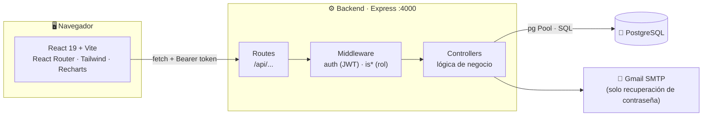
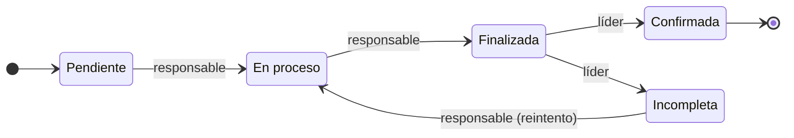

<div align="center">


# ZENDA

### Sistema de gestión y seguimiento de proyectos formativos · ADSO · SENA

Plataforma web para que los aprendices **desarrollen su proyecto por fases**, suban sus evidencias y reciban la **evaluación del instructor**, con seguimiento del coordinador y administración centralizada.

<br />


[Descripción](#-descripción) ·
[Inicio rápido](#-inicio-rápido) ·
[Documentación](#-documentación) ·
[Estado](#-estado-del-proyecto) ·
[Contribuir](#-flujo-de-trabajo-con-git)

</div>

---

## 📑 Tabla de contenidos

1. [Descripción](#-descripción)
2. [Funcionalidades](#-funcionalidades)
3. [Perfiles de usuario](#-perfiles-de-usuario)
4. [Stack tecnológico](#-stack-tecnológico)
5. [Arquitectura](#-arquitectura)
6. [Reglas de negocio esenciales](#-reglas-de-negocio-esenciales)
7. [Inicio rápido](#-inicio-rápido)
8. [Estructura del repositorio](#-estructura-del-repositorio)
9. [Documentación](#-documentación)
10. [Seguridad](#-seguridad)
11. [Estado del proyecto](#-estado-del-proyecto)
12. [Flujo de trabajo con Git](#-flujo-de-trabajo-con-git)
13. [Equipo](#-equipo)

---

## 📖 Descripción

### El problema

El seguimiento de los proyectos que los aprendices de **Análisis y Desarrollo de Software (ADSO)** desarrollan durante su formación se hace de forma manual: entregables dispersos, listas de chequeo en papel y poca visibilidad del avance real de cada grupo.

### La solución

**ZENDA** centraliza ese proceso en un flujo digital:

1. Un aprendiz **crea el proyecto** de su grupo (y queda como **líder**) o se **une** a uno con un código de invitación.
2. El proyecto avanza por **5 fases fijas**. En cada fase el equipo organiza **carpetas** y sube **evidencias**.
3. El **instructor** evalúa cada evidencia y el estado de la carpeta y de la fase se calcula automáticamente.
4. El **coordinador** supervisa el progreso del programa y el **administrador** gestiona usuarios, fichas y programas.

> [!NOTE]
> ZENDA usa un **tablero de tareas inspirado en Scrum**, pero **no implementa roles Scrum** (Scrum Master, Product Owner, Developer). Todos los aprendices de un grupo tienen los mismos permisos; la única figura diferenciada es el **líder de grupo**.

---

## ✨ Funcionalidades

| Módulo | Qué ofrece |
|---|---|
| 🔐 **Autenticación** | Registro de aprendices con correo institucional, inicio de sesión con JWT y recuperación de contraseña por correo. |
| 👥 **Grupos y proyectos** | Creación de proyecto con código de invitación `PRY-XXXXXX`; un aprendiz solo puede estar en un proyecto activo. |
| 🗂️ **Fases, carpetas y evidencias** | 5 fases fijas por proyecto; el aprendiz crea carpetas y sube evidencias dentro de cada fase. |
| ✅ **Evaluación en cascada** | Evidencia → carpeta → fase: el estado se recalcula solo a partir de las evaluaciones del instructor. |
| 🧩 **Tablero de tareas** | Tareas asignadas por el líder, con flujo de estados y confirmación del líder. |
| 📊 **Dashboards** | Gráficas y métricas para cada rol. |
| 🧾 **Reportes** | Exportación a PDF (aprendiz e instructor) y reporte en CSV/Excel (coordinador). |
| 🛡️ **Administración** | Gestión de usuarios, fichas, programas e instructores, con acciones delicadas confirmadas por contraseña. |
| 🌗 **Interfaz** | Tema claro y oscuro, aviso de cookies. |

Las funcionalidades aprobadas para la siguiente versión (archivos reales, lista de chequeo, mejoras de seguridad e interfaz) están en [Estado del proyecto](#-estado-del-proyecto).

---

## 👥 Perfiles de usuario

Los roles son un `ENUM` en la base de datos: `APRENDIZ`, `INSTRUCTOR`, `COORDINADOR`, `ADMINISTRADOR`.

| Perfil | Ruta | Qué resuelve |
|---|---|---|
| 🎓 **Aprendiz** | `/aprendiz` | Crea o se une a un proyecto, sube evidencias, consulta observaciones y mueve sus tareas. El **líder** además crea y asigna tareas y confirma su cumplimiento. |
| 👨‍🏫 **Instructor** | `/instructor` | Revisa las evidencias de sus fichas, las aprueba o reprueba y deja observaciones al proyecto. |
| 🧭 **Coordinador** | `/coordinador` | Supervisa fichas, grupos y proyectos del programa **ADSO** (código `2338`) y reasigna instructores. |
| 🛡️ **Administrador** | `/admin` | Gestiona usuarios, fichas y programas de toda la plataforma. |

> [!TIP]
> El detalle de permisos por rol está en [`docs/requisitos/matriz-permisos.md`](docs/requisitos/matriz-permisos.md).

---

## 🧰 Stack tecnológico

| Capa | Tecnología | Función |
|---|---|---|
| **Frontend** | React 19 · Vite 8 · React Router 7 · Tailwind CSS 4 · Recharts · Lucide | Aplicación de una sola página (SPA) |
| **Backend** | Node.js · Express 4 · `pg` · `jsonwebtoken` · `bcryptjs` · Nodemailer | API REST con SQL directo (sin ORM) |
| **Base de datos** | PostgreSQL 14+ | Persistencia relacional (13 tablas, 1 tipo `ENUM`) |
| **Gestor de paquetes** | **pnpm** | Instalación reproducible con `pnpm-lock.yaml` |

> [!IMPORTANT]
> El proyecto usa **pnpm** como único gestor de paquetes. No uses `npm install` ni `yarn`: generarían lockfiles distintos.

---

## 🏗️ Arquitectura



**Cómo fluye una petición**

1. El frontend llama a la API desde un único módulo (`frontend/src/api.js`).
2. El token JWT viaja en la cabecera `Authorization: Bearer <token>`.
3. El middleware `auth` valida el token y los middlewares `is*` validan el rol.
4. El controlador ejecuta la lógica y consulta PostgreSQL mediante un `Pool`.

Más detalle en [`docs/referencia-tecnica/arquitectura.md`](docs/referencia-tecnica/arquitectura.md).

---

## 📐 Reglas de negocio esenciales

| # | Regla |
|---|---|
| 1 | El autoregistro es **solo para aprendices** y exige correo `@soy.sena.edu.co`. |
| 2 | Cada ficha tiene un grupo especial **`General`**: es la inscripción del aprendiz a la ficha y **no cuenta como proyecto**. |
| 3 | Un aprendiz solo puede pertenecer a **un proyecto activo** a la vez. |
| 4 | El aprendiz que **crea el proyecto es el líder** del grupo. El liderazgo queda fijo; si el líder abandona o su cuenta se desactiva, el **administrador** lo reasigna. |
| 5 | Todos los integrantes pueden **crear carpetas y subir evidencias**. Solo el **líder** crea y asigna tareas y confirma su cumplimiento. |
| 6 | Cada proyecto tiene **5 fases fijas**: Análisis, Diseño, Desarrollo, Pruebas y Cierre/Entrega. |
| 7 | La evaluación es **en cascada**: una evidencia reprobada desaprueba su carpeta, y una carpeta desaprobada desaprueba su fase. |
| 8 | Las cuentas con estado distinto de `Activo` no pueden iniciar sesión. |



El catálogo completo está en [`docs/requisitos/reglas-de-negocio.md`](docs/requisitos/reglas-de-negocio.md).

---

## 🚀 Inicio rápido

### Requisitos previos

| Herramienta | Versión | Notas |
|---|---|---|
| [Node.js](https://nodejs.org/) | **22 (LTS)** | Usa siempre una versión LTS |
| [pnpm](https://pnpm.io/installation) | reciente | Gestor de paquetes del proyecto |
| [PostgreSQL](https://www.postgresql.org/download/) | **14 o superior** | Con el cliente `psql` |
| [Git](https://git-scm.com/) | cualquiera | Para clonar el repositorio |

### 1. Clonar y crear la base de datos

```bash
git clone https://github.com/player7842/ZENDA.git
cd ZENDA
git checkout develop

psql -U postgres -h localhost -c "CREATE DATABASE zenda;"
psql -U postgres -h localhost -d zenda -f Database/zenda_bd.sql
```

> [!WARNING]
> `zenda_bd.sql` **borra y recrea** todas las tablas. No lo ejecutes sobre una base con datos que quieras conservar.

### 2. Backend

```bash
cd backend
pnpm install
```

Crea `backend/.env` con las variables descritas en [`docs/setup/variables-de-entorno.md`](docs/setup/variables-de-entorno.md) (`DB_*`, `JWT_SECRET`, `EMAIL_*`) y arranca:

```bash
pnpm dev                                # recarga automática
curl http://localhost:4000/api/health   # comprobación
```

### 3. Frontend

En otra terminal:

```bash
cd frontend
pnpm install
pnpm dev                                # http://localhost:5173
```

> [!NOTE]
> Las credenciales de prueba y las guías completas (con y sin Docker) están en [`docs/setup/`](docs/setup/).

---

## 📂 Estructura del repositorio

```text
ZENDA/
├── README.md
├── Database/
│   └── zenda_bd.sql                 # Esquema (13 tablas) + datos de prueba
│
├── backend/                         # API REST · Express + PostgreSQL
│   ├── server.js                    # Punto de entrada
│   └── src/
│       ├── config/                  # db.js (pool de PostgreSQL)
│       ├── middleware/              # auth.js · isAdmin · isCoordinador · isInstructor · isAprendiz
│       ├── routes/                  # admin/ · aprendiz/ · coordinador/ · instructor/
│       ├── controllers/             # Lógica de negocio por rol
│       └── utils/                   # confirmarAdmin.js · mailer.js
│
├── frontend/                        # SPA · React + Vite
│   └── src/
│       ├── api.js                   # Todas las llamadas HTTP al backend
│       ├── context/                 # ThemeContext (tema claro/oscuro)
│       ├── components/              # Auth/ · admin/ · ui/
│       ├── pages/                   # Una carpeta por rol
│       └── styles/                  # CSS por pantalla
│
└── docs/                            # Documentación del proyecto (ver abajo)
```

---

## 📚 Documentación

Toda la documentación vive en [`docs/`](docs/) y está escrita en Markdown para leerse directamente en GitHub.

| Carpeta | Contenido | Estado |
|---|---|---|
| [`docs/requisitos/`](docs/requisitos/) | Historias de usuario, requisitos funcionales y no funcionales, reglas de negocio, matriz de permisos, restricciones y trazabilidad | 🟡 En elaboración |
| [`docs/diagramas/`](docs/diagramas/) | Contexto, componentes, clases, dominio, MER/MR, actividades, estados y procesos (en Mermaid) | 🟡 En elaboración |
| [`docs/referencia-tecnica/`](docs/referencia-tecnica/) | Arquitectura, esquema de base de datos, endpoints y sistema de diseño | 🟡 En elaboración |
| [`docs/setup/`](docs/setup/) | Instalación con y sin Docker, variables de entorno | 🟡 En elaboración |
| [`docs/conceptos/`](docs/conceptos/) | Seguridad (OWASP), autenticación JWT, patrones y accesibilidad | ⚪ Pendiente |
| [`docs/colaboracion/`](docs/colaboracion/) | Flujo de Git y convenciones | ⚪ Pendiente |
| [`docs/testing/`](docs/testing/) | Plan y casos de prueba | ⚪ Pendiente |
| [`docs/gestion/`](docs/gestion/) | Backlog priorizado, cronograma y riesgos | ⚪ Pendiente |
| [`docs/decisiones/`](docs/decisiones/) | Registro de decisiones de arquitectura (ADR) | ⚪ Pendiente |

---

## 🛡️ Seguridad

| Medida | Estado | Detalle |
|---|:---:|---|
| Contraseñas con hash **bcrypt** | ✅ | Nunca se guardan en texto plano. |
| Sesión con **JWT** | ✅ | Hoy expira a las 24 h; el objetivo es 15 min con refresh y cierre por inactividad. |
| Autorización por rol | ✅ | Middlewares `isAdmin`, `isCoordinador`, `isInstructor`, `isAprendiz`. |
| Confirmación con contraseña | ✅ | Acciones delicadas del administrador y del coordinador. |
| Transacciones SQL | ✅ | `BEGIN / COMMIT / ROLLBACK` en operaciones compuestas. |
| Recuperación de contraseña | ✅ | Token de 15 minutos enviado por correo. |
| Secretos fuera del repositorio | ⚠️ | `.env` no se versiona; falta publicar un `.env.example` y quitar el secreto por defecto del código. |

> [!WARNING]
> **Nunca subas `backend/.env` a GitHub.** Si una credencial se expuso alguna vez, revócala y genera una nueva.

---

## 🚧 Estado del proyecto

### ✅ Implementado (v11)

- Autenticación completa: registro, inicio de sesión y recuperación de contraseña.
- Paneles y dashboards para los 4 roles.
- Proyectos con 5 fases, carpetas, evidencias (enlace), evaluación en cascada y observaciones.
- Tablero de tareas con flujo de estados.
- Gestión de usuarios, fichas e instructores.
- Exportación a PDF mediante impresión del navegador y reporte CSV del coordinador.

### 🔄 Cambios aprobados para la siguiente versión

| Cambio | Resumen |
|---|---|
| **Sin sub-roles Scrum** | Se elimina el rol Scrum del registro y de la base de datos; queda el **líder de grupo**. |
| **Todos suben evidencias** | Cualquier integrante crea carpetas y sube evidencias; se registra quién subió cada una. |
| **Archivos reales** | Evidencias como archivo (con compresión de imágenes) o enlace, en almacenamiento compatible con S3. |
| **Aprobación por carpeta** | El instructor puede aprobar una carpeta completa; el porcentaje de la fase se calcula sobre evidencias aprobadas. |
| **Lista de chequeo** | Una por ficha, creada por el instructor (editor o importación de Excel), copiable entre fichas y con historial de evaluación. |
| **Cupo del grupo** | El líder define la cantidad de integrantes al crear el proyecto. |
| **Registro seguro** | Medidor de contraseña, aceptación obligatoria de legales, bloqueo de pegado en "confirmar contraseña" y tipo de documento **PPT**. |
| **Páginas legales** | Términos de uso, política de privacidad, política de cookies y protección de datos enlazadas desde el footer. |
| **Interfaz** | Contrastes, animaciones consistentes, dashboard colapsable, menú de tres puntos, botón "Volver al inicio" y año vigente automático. |
| **Sesiones** | Access token de 15 min, refresh token y cierre por inactividad. |

### 🛠️ Pendiente técnico

- Endpoints del backend para **programas**, **importación de usuarios por CSV**, **copia de seguridad** y **diagnóstico** (la interfaz ya existe).
- Contenedores **Docker** y versiones exactas en los `package.json` (hoy usan rangos `^`).
- Pruebas automatizadas y pipeline de CI.

### ❌ Fuera del alcance

Chatbot, calendario de eventos, anuncios y recordatorios masivos. Se reemplazan los recordatorios por **mensajes guiados** dentro de la interfaz.

---

## 🔀 Flujo de trabajo con Git

| Rama | Propósito |
|---|---|
| `main` | Versión estable, lista para entregar o desplegar. |
| `develop` | Integración de cambios y versionamiento. |
| `feat/*` · `fix/*` · `docs/*` | Ramas de trabajo que se fusionan en `develop` mediante Pull Request. |

```bash
git checkout develop
git checkout -b feat/nombre-de-la-funcionalidad
git status                       # verifica que no aparezcan node_modules/, .env ni dist/
git add .
git commit -m "feat: descripción corta del cambio"
git push -u origin feat/nombre-de-la-funcionalidad
```

| Prefijo | Uso |
|---|---|
| `feat:` | Nueva funcionalidad |
| `fix:` | Corrección de un error |
| `docs:` | Cambios en la documentación |
| `style:` | Formato o estilos, sin cambio de lógica |
| `refactor:` | Reestructuración de código |
| `chore:` | Dependencias y tareas de mantenimiento |

---

## 👤 Equipo

| Integrante | Rol en el proyecto | GitHub |
|---|---|---|
| Propietario del repositorio | Desarrollo | [@player7842](https://github.com/player7842) |

<!-- Agrega aquí a los demás integrantes del equipo en el mismo formato. -->

---

<div align="center">

**ZENDA** · Sistema de gestión de proyectos formativos ADSO

Hecho para la formación en **Análisis y Desarrollo de Software** · SENA

</div>
