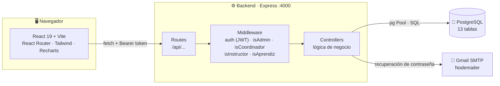
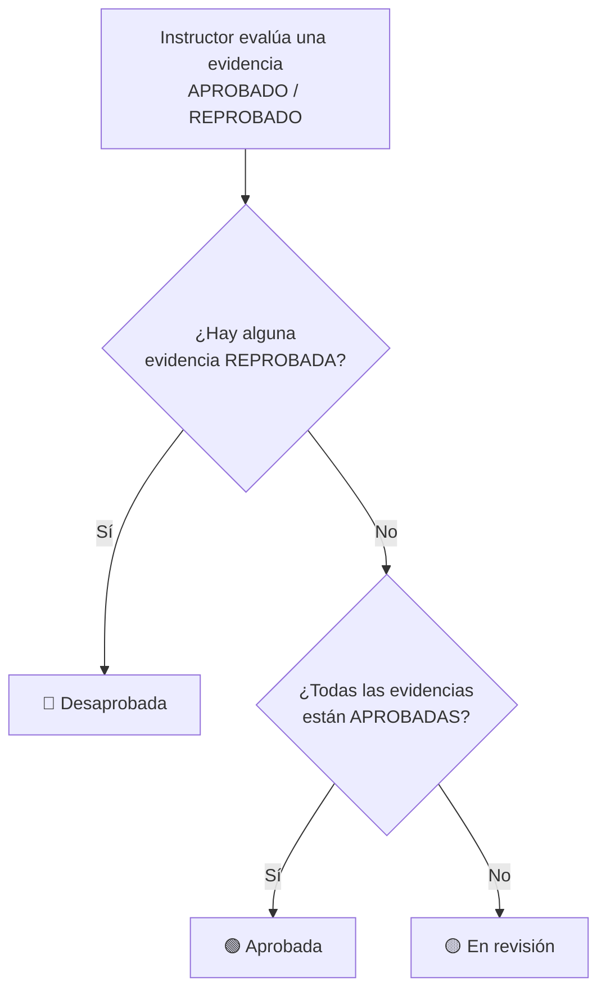
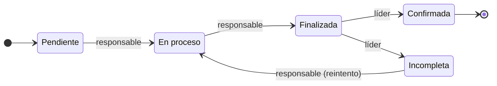
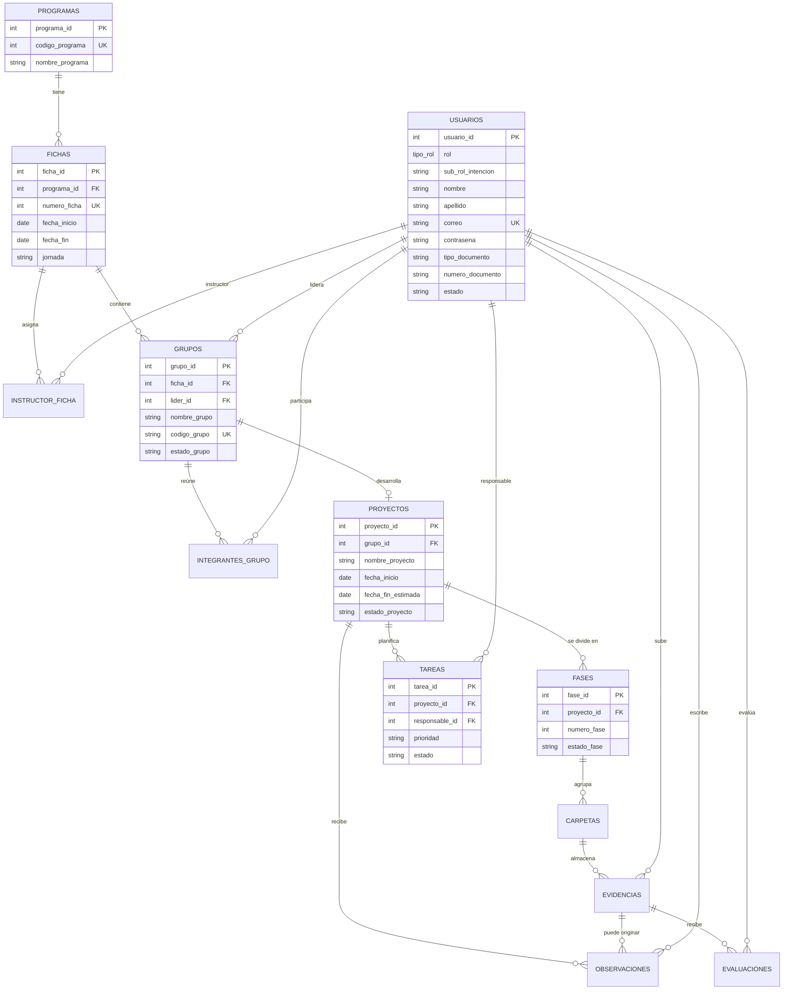

<div align="center">


# ZENDA

### Sistema de Gestión de Proyectos Formativos — ADSO · SENA

Plataforma web para **gestionar proyectos de aprendices por fases**, con evidencias, evaluación del instructor, seguimiento del coordinador y administración centralizada de fichas, programas y usuarios.

<br />


[Instalación](#-instalación-paso-a-paso) ·
[Roles](#-roles-y-qué-puede-hacer-cada-uno) ·
[Base de datos](#-modelo-de-datos) ·
[API](#-referencia-de-la-api) ·
[Pendientes](#-estado-del-proyecto-y-pendientes)

</div>

---

## 📑 Tabla de contenidos

1. [Descripción](#-descripción)
2. [Stack tecnológico](#-stack-tecnológico)
3. [Arquitectura](#-arquitectura)
4. [Roles y qué puede hacer cada uno](#-roles-y-qué-puede-hacer-cada-uno)
5. [Reglas de negocio](#-reglas-de-negocio)
6. [Modelo de datos](#-modelo-de-datos)
7. [Requisitos previos](#-requisitos-previos)
8. [Instalación paso a paso](#-instalación-paso-a-paso)
9. [Variables de entorno](#-variables-de-entorno)
10. [Scripts disponibles](#-scripts-disponibles)
11. [Credenciales de prueba](#-credenciales-de-prueba)
12. [Estructura del proyecto](#-estructura-del-proyecto)
13. [Referencia de la API](#-referencia-de-la-api)
14. [Seguridad](#-seguridad)
15. [Estado del proyecto y pendientes](#-estado-del-proyecto-y-pendientes)
16. [Solución de problemas](#-solución-de-problemas)
17. [Flujo de trabajo con Git](#-flujo-de-trabajo-con-git)
18. [Equipo](#-equipo)

---

## 📖 Descripción

**ZENDA** centraliza el seguimiento de los proyectos que los aprendices del programa **Análisis y Desarrollo de Software (ADSO)** desarrollan durante su formación. Reemplaza el control manual de entregables por un flujo digital con cuatro perfiles:

| Perfil | Qué resuelve |
|---|---|
| 🎓 **Aprendiz** | Crea o se une a un proyecto en equipo, organiza el trabajo con tareas estilo Scrum y registra evidencias por fase. |
| 👨‍🏫 **Instructor** | Revisa evidencias, las aprueba o reprueba y deja observaciones al proyecto. |
| 🧭 **Coordinador** | Supervisa fichas, grupos y proyectos del programa y asigna instructores. |
| 🛡️ **Administrador** | Gestiona usuarios, fichas y programas de toda la plataforma. |

### ✨ Funcionalidades destacadas

- 🔐 Autenticación con **JWT** y rutas protegidas por rol.
- 📧 **Recuperación de contraseña por correo** (Nodemailer + Gmail).
- 🗂️ Proyectos con **5 fases fijas**, carpetas de entrega y evidencias.
- ✅ **Evaluación en cascada**: el estado de cada fase se calcula solo a partir de sus evidencias.
- 🧩 **Tablero de tareas** (Kanban / tabla) con flujo de estados y permisos por rol Scrum.
- 📊 **Dashboards con gráficas** para cada rol (Recharts).
- 🔑 Acciones delicadas del administrador **confirmadas con contraseña**.
- 🌗 **Tema claro y oscuro**.
- 📥 **Carga masiva de usuarios** por CSV desde el panel admin.
- 🍪 Aviso de cookies/almacenamiento local.

---

## 🧰 Stack tecnológico

### Núcleo

| Capa | Tecnología | Función en ZENDA |
|---|---|---|
| Frontend | **React + Vite** | Aplicación de una sola página (SPA) |
| Backend | **Express** | API REST |
| Base de datos | **PostgreSQL** | Persistencia relacional |
| Entorno | **Node.js + pnpm** | Ejecución y gestión de paquetes |

### Librerías principales

<table>
<tr>
<td valign="top" width="50%">

**Frontend**

| Librería | Versión | Uso |
|---|---|---|
| react / react-dom | ^19.2 | Interfaz |
| vite | ^8.2 | Bundler y servidor de desarrollo |
| react-router-dom | ^7.1 | Navegación por rutas |
| tailwindcss + `@tailwindcss/vite` | ^4.3 | Estilos utilitarios |
| recharts | ^3.10 | Gráficas |
| lucide-react | ^1.41 | Íconos |
| oxlint | ^1.79 | Linter |

</td>
<td valign="top" width="50%">

**Backend**

| Librería | Versión | Uso |
|---|---|---|
| express | ^4.21 | Servidor HTTP |
| pg | ^8.13 | Conexión a PostgreSQL (pool) |
| jsonwebtoken | ^9.0 | Tokens de sesión |
| bcryptjs | ^2.4 | Hash de contraseñas |
| nodemailer | ^10.0 | Envío de correos |
| cors | ^2.8 | Política CORS |
| dotenv | ^16.4 | Variables de entorno |
| nodemon | ^3.1 | Recarga en desarrollo |

</td>
</tr>
</table>

> [!NOTE]
> El proyecto usa **SQL directo** con `pg` (sin ORM). El frontend está escrito en JavaScript (JSX).

---

## 🏗️ Arquitectura



**Cómo fluye una petición**

1. El frontend llama a la API con `fetch` (todas las llamadas están centralizadas en `frontend/src/api.js`).
2. El token JWT viaja en la cabecera `Authorization: Bearer <token>`.
3. El middleware `auth` valida el token y los middlewares `is*` validan el rol.
4. El controlador ejecuta la lógica y consulta PostgreSQL mediante un `Pool`.
5. La sesión se guarda en `localStorage` (`zenda-token`).

**Redirección por rol tras el login**

| Rol | Ruta |
|---|---|
| `ADMINISTRADOR` | `/admin` |
| `COORDINADOR` | `/coordinador` |
| `INSTRUCTOR` | `/instructor` |
| `APRENDIZ` | `/aprendiz` |

---

## 👥 Roles y qué puede hacer cada uno

Los roles son un `ENUM` en mayúsculas en la base de datos: `APRENDIZ`, `INSTRUCTOR`, `COORDINADOR`, `ADMINISTRADOR`.

### 🎓 Aprendiz — `/aprendiz`

| Sección | Qué hace |
|---|---|
| **Resumen** | Avance de las fases del proyecto con gráficas. |
| **Mi proyecto** | Ficha del proyecto: descripción, problema, objetivo, alcance y tecnologías. Muestra el código de invitación. |
| **Equipo** | Integrantes del grupo y su rol Scrum. |
| **Fases** | Lista de chequeo por fase: carpetas, evidencias y resultado de evaluación. El líder crea carpetas y sube evidencias. |
| **Observaciones** | Comentarios que el instructor publicó sobre el proyecto. |
| **Tareas** | Tablero Kanban/tabla con prioridades y flujo de estados. |

Además, el aprendiz puede **corregir su ficha** mientras no tenga un proyecto activo.

### 👨‍🏫 Instructor — `/instructor`

| Sección | Qué hace |
|---|---|
| **Resumen** | Métricas de sus fichas: evidencias aprobadas, reprobadas y sin evaluar. |
| **Mis fichas** | Fichas asignadas y sus aprendices y grupos. |
| **Proyectos** | Proyectos por ficha con revisión rápida de evidencias, observaciones y exportación de la ficha a PDF. |

### 🧭 Coordinador — `/coordinador`

> Su alcance es el programa **ADSO** (`codigo_programa = 2338`).

| Sección | Qué hace |
|---|---|
| **Resumen** | Totales generales del programa y estados de los proyectos. |
| **Fichas** | Fichas ADSO con conteos de aprendices e instructores. |
| **Instructores** | Instructores y sus fichas; permite reasignar fichas (confirmando con contraseña). |
| **Grupos** | Grupos de proyecto (excluye el grupo "General"). |
| **Proyectos** | Proyectos con porcentaje de progreso. |
| **Seguimiento** | Detalle de un proyecto: integrantes, fases y observaciones. |

### 🛡️ Administrador — `/admin`

| Sección | Qué hace |
|---|---|
| **Resumen** | Métricas globales de la plataforma. |
| **Fichas** | CRUD de fichas y de los aprendices vinculados. |
| **Programas** | CRUD de programas de formación. ⚠️ *Backend pendiente.* |
| **Instructores** | Ver y editar las fichas vinculadas a cada instructor. |
| **Usuarios** | Listado por rol, crear, editar, cambiar rol y eliminar. Carga masiva por CSV. ⚠️ *La importación masiva requiere backend pendiente.* |
| **Sistema** | Diagnóstico y copias de seguridad. ⚠️ *Backend pendiente.* |

---

## 📐 Reglas de negocio

### Grupo "General" y proyectos

- Cada ficha tiene un grupo especial llamado **`General`**. Es solo la **inscripción del aprendiz a la ficha**; no cuenta como proyecto.
- Un aprendiz solo puede estar en **un proyecto activo** a la vez (grupo distinto de `General`).
- Al crear un proyecto se genera el grupo, el aprendiz queda como **Scrum Master (líder)**, se crean las **5 fases** y se genera un **código de invitación** con formato `PRY-XXXXXX`.
- Otro aprendiz se une con ese código eligiendo **Product Owner** o **Developer**. Solo puede haber **un Product Owner** por grupo.

### Fases del proyecto

Las 5 fases fijas son: **Análisis → Diseño → Desarrollo → Pruebas → Cierre/Entrega**.

El estado de una fase se recalcula cada vez que el instructor evalúa una evidencia:



| Estado de fase | Cuándo ocurre |
|---|---|
| `Pendiente` | Estado inicial al crear el proyecto. |
| `En revisión` | Hay evidencias sin evaluar y ninguna reprobada. |
| `Aprobada` | Todas las evidencias de la fase están aprobadas. |
| `Desaprobada` | Al menos una evidencia está reprobada. |

### Tareas (Scrum)



| Regla | Detalle |
|---|---|
| Quién crea y asigna | Solo el **Scrum Master (líder)** del grupo. |
| Quién avanza la tarea | El **responsable asignado**: Pendiente → En proceso → Finalizada. |
| Quién confirma | Solo el **líder**: marca `Confirmada` o `Incompleta` una tarea `Finalizada`. |
| Alcance | Las tareas pertenecen al **proyecto**, no a una fase. |
| Prioridades | `Alta`, `Media`, `Baja`. |

### Registro de usuarios

- El autoregistro es **solo para aprendices** y exige correo institucional **`@soy.sena.edu.co`**.
- Se debe elegir una **ficha existente** y un **rol Scrum** (`Scrum Master`, `Product Owner` o `Developer`).
- Al registrarse, el aprendiz queda vinculado automáticamente al grupo `General` de su ficha.
- Las cuentas con estado distinto de `Activo` no pueden iniciar sesión.

---

## 🗄️ Modelo de datos

La base de datos `zenda` tiene **13 tablas** y **1 tipo ENUM** (`tipo_rol`). Todo está en [`Database/zenda_bd.sql`](Database/zenda_bd.sql).

### Diagrama entidad-relación



### Descripción de las tablas

| Tabla | Propósito | Claves y restricciones destacadas |
|---|---|---|
| `programas` | Programas de formación (ej. ADSO). | `codigo_programa` único. |
| `usuarios` | Todas las personas del sistema, con su rol. | `correo` único · `rol` es ENUM · `contrasena` guarda hash bcrypt. |
| `fichas` | Grupos de formación de un programa. | `numero_ficha` único · FK a `programas`. |
| `instructor_ficha` | Relación N:M entre instructores y fichas. | Único `(instructor_id, ficha_id)`. |
| `grupos` | Grupos de una ficha: el `General` y los de proyecto. | `codigo_grupo` único · `lider_id` → usuarios. |
| `integrantes_grupo` | Miembros de un grupo con su rol Scrum. | Único `(grupo_id, usuario_id)` · `fecha_salida` opcional. |
| `proyectos` | Proyecto de un grupo (su "README"). | `grupo_id` único: **un proyecto por grupo**. |
| `fases` | Las 5 fases de cada proyecto. | Único `(proyecto_id, numero_fase)`. |
| `carpetas` | Carpetas de entrega dentro de una fase. | FK a `fases`. |
| `evidencias` | Entregables (enlace o ubicación) subidos por el líder. | FK a `carpetas` y `usuarios`. |
| `evaluaciones` | Resultado `APROBADO` / `REPROBADO` de una evidencia. | FK a `evidencias` e instructor. |
| `observaciones` | Comentarios del instructor al proyecto. | `evidencia_id` es opcional. |
| `tareas` | Trabajo interno del equipo. | `CHECK` en `prioridad` y en `estado`. |

> [!NOTE]
> Las evidencias se registran como **enlace o ubicación** (`ubicacion`); la plataforma no almacena archivos subidos.

### Valores permitidos

| Campo | Valores |
|---|---|
| `usuarios.rol` | `APRENDIZ` · `INSTRUCTOR` · `COORDINADOR` · `ADMINISTRADOR` |
| `integrantes_grupo.rol_scrum` | `Scrum Master` · `Product Owner` · `Developer` |
| `evaluaciones.resultado` | `APROBADO` · `REPROBADO` |
| `fases.estado_fase` | `Pendiente` · `En revisión` · `Aprobada` · `Desaprobada` |
| `tareas.prioridad` | `Alta` · `Media` · `Baja` |
| `tareas.estado` | `Pendiente` · `En proceso` · `Finalizada` · `Confirmada` · `Incompleta` |

### Datos de prueba (seed)

El script carga datos listos para probar:

| Elemento | Cantidad / detalle |
|---|---|
| Programas | 3: ADSO (2338), Videojuegos (2288), Mantenimiento de Software (2515) |
| Fichas | 4: `2724285`, `2724310` (ADSO) · `2724290` (Videojuegos) · `2724315` (Mantenimiento) |
| Usuarios | 18: 1 admin, 2 coordinadores, 3 instructores, 12 aprendices |
| Grupos | Un grupo `General` por ficha, más grupos de proyecto de ejemplo |
| Proyectos | 3 proyectos con estados distintos (activo, finalizado, pausado) |
| Extras | Fases, carpetas, evidencias, evaluaciones, observaciones y tareas para poblar las gráficas |

---

## ✅ Requisitos previos

| Herramienta | Versión | Notas |
|---|---|---|
| [Node.js](https://nodejs.org/) | **20 o superior** | `nodemailer@10` exige Node ≥ 20 |
| [pnpm](https://pnpm.io/installation) | reciente | Gestor de paquetes del proyecto |
| [PostgreSQL](https://www.postgresql.org/download/) | **14 o superior** | Con el cliente `psql` disponible |
| [Git](https://git-scm.com/) | cualquiera | Para clonar el repositorio |
| Cuenta de Gmail | opcional | Solo para la recuperación de contraseña |

---

## 🚀 Instalación paso a paso

### 1️⃣ Clonar el repositorio

```bash
git clone https://github.com/player7842/ZENDA.git
cd ZENDA
```

### 2️⃣ Crear la base de datos

```bash
psql -U postgres -h localhost -c "CREATE DATABASE zenda;"
psql -U postgres -h localhost -d zenda -f Database/zenda_bd.sql
```

> [!WARNING]
> `zenda_bd.sql` **borra y recrea** todas las tablas (`DROP TABLE ... CASCADE`). No lo ejecutes sobre una base con datos que quieras conservar.

### 3️⃣ Configurar y arrancar el backend

```bash
cd backend
cp .env.example .env        # En Windows (CMD): copy .env.example .env
pnpm install
```

Edita `backend/.env` con tus credenciales (ver [Variables de entorno](#-variables-de-entorno)) y arranca:

```bash
pnpm dev        # con recarga automática (nodemon)
# o
pnpm start      # ejecución normal
```

Comprueba que responde:

```bash
curl http://localhost:4000/api/health
```

### 4️⃣ Configurar y arrancar el frontend

En **otra terminal**:

```bash
cd frontend
cp .env.example .env
pnpm install
pnpm dev
```

### 5️⃣ Abrir la aplicación

Entra a **http://localhost:5173** e inicia sesión con alguna de las [credenciales de prueba](#-credenciales-de-prueba).

---

## 🔧 Variables de entorno

### Backend — `backend/.env`

| Variable | Obligatoria | Ejemplo | Descripción |
|---|:---:|---|---|
| `PORT` | No | `4000` | Puerto del servidor (por defecto `4000`). |
| `DB_USER` | ✅ | `postgres` | Usuario de PostgreSQL. |
| `DB_PASSWORD` | ✅ | `tu_password` | Contraseña de PostgreSQL. |
| `DB_HOST` | ✅ | `localhost` | Host de la base de datos. |
| `DB_PORT` | No | `5432` | Puerto de PostgreSQL (por defecto `5432`). |
| `DB_NAME` | ✅ | `zenda` | Nombre de la base de datos. |
| `JWT_SECRET` | ✅ | `una_frase_larga_y_secreta` | Secreto para firmar los JWT. **Cámbialo en producción.** |
| `EMAIL_USER` | Solo para recuperar contraseña | `tu_correo@gmail.com` | Cuenta Gmail remitente. |
| `EMAIL_PASS` | Solo para recuperar contraseña | `abcd efgh ijkl mnop` | **Contraseña de aplicación** de Gmail (16 caracteres). |

Plantilla lista para copiar (`backend/.env.example`):

```env
PORT=4000
DB_USER=postgres
DB_PASSWORD=tu_password
DB_HOST=localhost
DB_PORT=5432
DB_NAME=zenda
JWT_SECRET=una_frase_secreta_bien_larga
EMAIL_USER=tu_correo@gmail.com
EMAIL_PASS=contraseña_de_aplicacion_de_16_letras
```

<details>
<summary><b>📧 Cómo obtener la contraseña de aplicación de Gmail</b></summary>

<br />

1. Activa la **verificación en dos pasos** en tu cuenta de Google.
2. Entra a [myaccount.google.com/apppasswords](https://myaccount.google.com/apppasswords).
3. Crea una contraseña de aplicación (por ejemplo, "ZENDA").
4. Copia los 16 caracteres en `EMAIL_PASS`.

> Nunca uses tu contraseña normal de Gmail y nunca subas el `.env` al repositorio.

</details>

### Frontend — `frontend/.env`

| Variable | Obligatoria | Ejemplo | Descripción |
|---|:---:|---|---|
| `VITE_API_URL` | No | `http://localhost:4000` | URL base del backend. En producción, la URL del backend desplegado. |

---

## 📜 Scripts disponibles

### Backend (`cd backend`)

| Comando | Descripción |
|---|---|
| `pnpm dev` | Inicia el servidor con **nodemon** (recarga al guardar). |
| `pnpm start` | Inicia el servidor con `node server.js`. |

### Frontend (`cd frontend`)

| Comando | Descripción |
|---|---|
| `pnpm dev` | Servidor de desarrollo de Vite (`http://localhost:5173`). |
| `pnpm build` | Genera la versión de producción en `dist/`. |
| `pnpm preview` | Sirve localmente el build de producción. |
| `pnpm lint` | Ejecuta **oxlint**. |

---

## 🔑 Credenciales de prueba

> [!IMPORTANT]
> Son datos **solo para desarrollo local**, sembrados por `zenda_bd.sql`. Cámbialos o elimínalos antes de cualquier despliegue real.

| Rol | Correo | Contraseña |
|---|---|---|
| 🛡️ Administrador | `admin@zenda.com` | `Admin123!` |
| 🧭 Coordinadores | `maria@zenda.com` · `julian@zenda.com` | `Prueba123!` |
| 👨‍🏫 Instructores | `felipe@zenda.com` · `rosa@zenda.com` · `pedro@zenda.com` | `Prueba123!` |
| 🎓 Aprendices | `carlos@zenda.com` · `juan@zenda.com` · `marta@zenda.com` · `laura@zenda.com` · `luis@zenda.com` · `ana@zenda.com` · `sofia@zenda.com` · `camila@zenda.com` · `jose@zenda.com` · `diego@zenda.com` · `valentina@zenda.com` · `sara@zenda.com` | `Prueba123!` |

**Distribución de instructores por ficha**

| Instructor | Fichas |
|---|---|
| Felipe Castro | `2724285` · `2724310` |
| Rosa Silva | `2724310` · `2724315` |
| Pedro Contreras | `2724290` · `2724315` |

> Los usuarios de prueba usan el dominio `@zenda.com` solo para iniciar sesión. El **autoregistro** exige correo `@soy.sena.edu.co`.

Para convertir un usuario existente en administrador directamente en la base de datos:

```sql
UPDATE usuarios SET rol = 'ADMINISTRADOR' WHERE correo = 'elcorreo@ejemplo.com';
```

---

## 📂 Estructura del proyecto

```text
ZENDA/
├── README.md
├── .gitignore
│
├── Database/
│   └── zenda_bd.sql                    # Esquema (13 tablas) + datos de prueba
│
├── backend/                            # API REST · Express + PostgreSQL
│   ├── .env.example                    # Plantilla de variables de entorno
│   ├── package.json
│   ├── pnpm-lock.yaml
│   ├── server.js                       # Punto de entrada: CORS, rutas, puerto
│   └── src/
│       ├── config/
│       │   └── db.js                   # Pool de PostgreSQL
│       ├── middleware/
│       │   ├── auth.js                 # Valida el JWT → req.user
│       │   ├── isAdmin.js
│       │   ├── isCoordinador.js
│       │   ├── isInstructor.js
│       │   └── isAprendiz.js
│       ├── routes/
│       │   ├── admin/                  # auth.js · users.js · fichas.js
│       │   ├── aprendiz/               # proyecto.js
│       │   ├── coordinador/            # coordinador.js
│       │   └── instructor/             # instructor.js
│       ├── controllers/
│       │   ├── adminController/        # authController · userController · fichasController
│       │   ├── aprendizController/     # proyectoController · tareaController
│       │   ├── coordinadorController/  # coordinadorController
│       │   └── instructorController/   # instructorController
│       └── utils/
│           ├── confirmarAdmin.js       # Verifica la contraseña en acciones delicadas
│           └── mailer.js               # Envío de correos (Nodemailer)
│
└── frontend/                           # SPA · React + Vite
    ├── .env.example
    ├── index.html
    ├── vite.config.js
    ├── package.json
    ├── pnpm-lock.yaml
    ├── public/
    │   ├── favicon.svg
    │   ├── icons.svg
    │   └── logos/                      # Logos claro/oscuro
    └── src/
        ├── main.jsx                    # Punto de entrada
        ├── App.jsx                     # Rutas de la aplicación
        ├── api.js                      # TODAS las llamadas HTTP al backend
        ├── index.css
        ├── context/
        │   └── ThemeContext.jsx        # Tema claro/oscuro
        ├── components/
        │   ├── Auth/                   # Login · Register · ForgotPassword · ResetPassword
        │   │                           # ProtectedRoute · AdminRoute · CoordinadorRoute
        │   │                           # InstructorRoute · AprendizRoute
        │   ├── admin/                  # Modals · BulkImportModal · ProgramFormModal
        │   ├── ui/                     # ChartBar · ChartDonut · ProgressBar
        │   │                           # StatCard · TimelineGantt
        │   ├── CookieBanner.jsx
        │   └── ThemeToggle.jsx
        ├── pages/
        │   ├── Home.jsx                # Página de inicio pública
        │   ├── Dashboard.jsx           # Landing para usuarios sin panel
        │   ├── Admin.jsx               # Panel administrador
        │   ├── aprendiz.jsx            # Panel aprendiz
        │   ├── coordinador.jsx         # Panel coordinador
        │   ├── instructor.jsx          # Panel instructor
        │   ├── admin/                  # Resumen · Fichas · Programas · Instructores
        │   │                           # Usuarios · Sistema
        │   ├── aprendiz/               # Resumen · MiProyecto · Equipo · Fases
        │   │                           # Observaciones · Tareas
        │   ├── coordinador/            # Resumen · Fichas · Instructores · Grupos
        │   │                           # Proyectos · Seguimiento
        │   └── instructor/             # Resumen · MisFichas · Proyectos
        └── styles/                     # CSS por pantalla (Admin, Login, Home, ...)
```

---

## 🔌 Referencia de la API

**URL base:** `http://localhost:4000`
**Formato:** JSON · **Autenticación:** `Authorization: Bearer <token>`

La API tiene **52 endpoints implementados**. La columna **Acceso** indica qué se necesita:

| Acceso | Significado |
|---|---|
| 🌐 Público | No requiere token. |
| 🔒 Token + rol | Requiere JWT y el rol indicado. |

### Autenticación y utilidades

| Método | Ruta | Acceso | Descripción |
|---|---|---|---|
| `GET` | `/api/health` | 🌐 | Comprueba que el servidor responde. |
| `POST` | `/api/auth/register` | 🌐 | Registra un aprendiz (correo `@soy.sena.edu.co`). |
| `POST` | `/api/auth/login` | 🌐 | Inicia sesión → `{ user, token }` (token de 24 h). |
| `POST` | `/api/auth/forgot-password` | 🌐 | Envía el enlace de recuperación al correo (token de 15 min). |
| `POST` | `/api/auth/reset-password` | 🌐 | Cambia la contraseña con el token. Mínimo 8 caracteres. |
| `GET` | `/api/fichas/publicas` | 🌐 | Lista de fichas para el formulario de registro. |

### 🛡️ Administrador — usuarios

| Método | Ruta | Descripción |
|---|---|---|
| `GET` | `/api/users` | Lista usuarios (instructores con sus fichas, aprendices con su ficha). |
| `GET` | `/api/users/:id` | Obtiene un usuario por ID. |
| `POST` | `/api/users` | Crea un usuario. Requiere `password` del admin. |
| `PUT` | `/api/users/:id` | Edita un usuario. |
| `PUT` | `/api/users/:id/fichas` | Reemplaza las fichas vinculadas de un instructor. |
| `PUT` | `/api/users/:id/rol` | Cambia el rol de un usuario. |
| `DELETE` | `/api/users/:id` | Elimina un usuario. Requiere `password`. |

### 🛡️ Administrador — fichas y programas

| Método | Ruta | Descripción |
|---|---|---|
| `GET` | `/api/fichas` | Lista fichas con programa y conteos. |
| `GET` | `/api/fichas/programas` | Programas disponibles para el formulario. |
| `POST` | `/api/fichas` | Crea una ficha. Requiere `password`. |
| `PUT` | `/api/fichas/:id` | Edita una ficha. |
| `DELETE` | `/api/fichas/:id` | Elimina una ficha y sus dependientes. |
| `PUT` | `/api/fichas/:id/aprendiz` | Vincula un aprendiz a la ficha. |
| `DELETE` | `/api/fichas/:id/aprendiz/:usuario_id` | Desvincula un aprendiz. |

### 🎓 Aprendiz — base `/api/aprendiz/proyectos`

| Método | Ruta | Descripción |
|---|---|---|
| `POST` | `/` | Crea grupo + proyecto + 5 fases y devuelve el código de invitación. |
| `POST` | `/unirse` | Se une a un grupo con `codigo_grupo` y `rol_scrum`. |
| `GET` | `/mio` | Proyecto activo: datos, integrantes y fases. |
| `GET` | `/resumen` | Datos agregados para el dashboard. |
| `GET` | `/observaciones` | Observaciones del instructor al proyecto. |
| `GET` | `/mi-ficha` | Ficha vigente del aprendiz. |
| `PUT` | `/mi-ficha` | Cambia la ficha (solo si no tiene proyecto activo). |
| `GET` | `/fases/:faseId/carpetas` | Lista de chequeo de una fase (cualquier integrante). |
| `POST` | `/fases/:faseId/carpetas` | Crea una carpeta (solo líder). |
| `POST` | `/carpetas/:carpetaId/evidencias` | Sube una evidencia (solo líder). |
| `GET` | `/tareas` | Tareas del proyecto. |
| `POST` | `/tareas` | Crea y asigna una tarea (solo líder). |
| `GET` | `/tareas/progreso` | Progreso de las tareas. |
| `PUT` | `/tareas/:id/estado` | Cambia el estado de una tarea según las reglas del flujo. |

### 👨‍🏫 Instructor — base `/api/instructor`

| Método | Ruta | Descripción |
|---|---|---|
| `GET` | `/resumen` | Métricas de sus fichas. |
| `GET` | `/fichas` | Fichas asignadas. |
| `GET` | `/fichas/:id/aprendices` | Aprendices de una ficha. |
| `GET` | `/fichas/:id/grupos` | Grupos de una ficha. |
| `GET` | `/fichas/:id/evidencias` | Evidencias de una ficha. |
| `GET` | `/proyectos/:proyectoId` | Datos del proyecto. |
| `GET` | `/proyectos/:proyectoId/observaciones` | Observaciones del proyecto. |
| `POST` | `/proyectos/:proyectoId/observaciones` | Crea una observación. |
| `GET` | `/fases/:faseId/carpetas` | Carpetas y evidencias de una fase. |
| `POST` | `/evidencias/:evidenciaId/evaluar` | Califica `APROBADO` o `REPROBADO` y recalcula la fase. |

### 🧭 Coordinador — base `/api/coordinador`

| Método | Ruta | Descripción |
|---|---|---|
| `GET` | `/dashboard` | Totales generales del programa. |
| `GET` | `/fichas` | Fichas ADSO con conteos. |
| `GET` | `/instructores` | Instructores y sus fichas ADSO. |
| `PUT` | `/instructores/:id/fichas` | Reasigna fichas a un instructor. Requiere `password`. |
| `GET` | `/grupos` | Grupos de proyecto (sin el `General`). |
| `GET` | `/proyectos` | Proyectos con porcentaje de progreso. |
| `GET` | `/proyectos/:id/seguimiento` | Detalle: integrantes, fases y observaciones. |
| `GET` | `/perfil` | Datos del coordinador autenticado. |

### Códigos de respuesta

| Código | Significado |
|---|---|
| `200` / `201` | Operación correcta / recurso creado. |
| `400` | Datos faltantes o inválidos, o contraseña de confirmación ausente. |
| `401` | Token ausente o inválido, o contraseña de confirmación incorrecta. |
| `403` | El rol no tiene permiso, o la cuenta está inactiva. |
| `404` | El recurso no existe. |
| `500` | Error interno del servidor. |

### Ejemplo rápido

```bash
# 1. Iniciar sesión
curl -X POST http://localhost:4000/api/auth/login \
  -H "Content-Type: application/json" \
  -d '{"correo":"admin@zenda.com","password":"Admin123!"}'

# 2. Usar el token en una ruta protegida
curl http://localhost:4000/api/users \
  -H "Authorization: Bearer <TOKEN>"
```

---

## 🛡️ Seguridad

| Medida | Cómo funciona |
|---|---|
| **Contraseñas** | Se almacenan con hash **bcrypt** (`bcryptjs`), nunca en texto plano. |
| **Sesión** | JWT firmado con `JWT_SECRET`; expira a las **24 horas**. |
| **Autorización** | Middlewares por rol (`isAdmin`, `isCoordinador`, `isInstructor`, `isAprendiz`). |
| **Confirmación con contraseña** | Crear, editar, eliminar, cambiar rol o reasignar fichas exige la contraseña de quien actúa. |
| **Transacciones** | Las operaciones compuestas (crear proyecto, unirse, evaluar) usan `BEGIN / COMMIT / ROLLBACK`. |
| **Recuperación de contraseña** | Token temporal de **15 minutos** enviado por correo. |
| **Secretos** | `.env` está en `.gitignore`; solo se versiona `.env.example`. |

> [!WARNING]
> **Nunca subas `backend/.env` a GitHub.** Si una credencial se expuso alguna vez (por ejemplo `EMAIL_PASS`), revócala y genera una nueva.

---

## 🚧 Estado del proyecto y pendientes

### Implementado ✅

- Autenticación completa (registro, login, recuperación de contraseña).
- Paneles para los 4 roles con sus dashboards.
- Proyectos por fases, evidencias, evaluación en cascada y observaciones.
- Tablero de tareas con flujo de estados y permisos.
- CRUD de usuarios y fichas, y gestión de instructores.

### Pendiente de backend ⚠️

El frontend ya tiene la interfaz y las funciones en `api.js`, pero **el backend aún no expone estas rutas** (hoy responden `404`):

| Funcionalidad | Ruta que llama el frontend | Pantalla |
|---|---|---|
| Crear, editar y eliminar programas | `POST/PUT/DELETE /admin/programas` | Admin → Programas |
| Importar usuarios por CSV | `POST /admin/usuarios/importar` | Admin → Usuarios |
| Copia de seguridad | `POST /api/admin/backup` | Admin → Sistema |
| Diagnóstico del sistema | `GET /api/admin/diagnostico` | Admin → Sistema |

### Mejoras sugeridas 💡

- [ ] Construir el enlace del correo de recuperación con una variable de entorno (hoy apunta a `http://localhost:5173`).
- [ ] Eliminar el secreto JWT por defecto del código y exigir `JWT_SECRET`.
- [ ] Unificar el prefijo `/api` en las rutas de administración.
- [ ] Pruebas automatizadas (unitarias y de integración).
- [ ] Contenedores (Docker) y pipeline de CI.
- [ ] Subida real de archivos para las evidencias.

---

## 🩺 Solución de problemas

| Problema | Causa probable | Solución |
|---|---|---|
| `ECONNREFUSED` al iniciar el backend | PostgreSQL apagado o credenciales incorrectas | Verifica que el servicio esté activo y revisa `DB_*` en `backend/.env`. |
| `database "zenda" does not exist` | No se creó la base | Ejecuta `CREATE DATABASE zenda;` y luego el script SQL. |
| El frontend muestra "Failed to fetch" | Backend apagado o `VITE_API_URL` incorrecta | Inicia el backend y revisa `frontend/.env`. |
| `401 Token inválido` en todas las rutas | `JWT_SECRET` cambió o el token expiró | Cierra sesión e inicia de nuevo. |
| No llega el correo de recuperación | `EMAIL_USER` / `EMAIL_PASS` mal configurados | Usa una **contraseña de aplicación** de Gmail, no la contraseña normal. |
| Error de versión de Node al instalar | Node menor a 20 | Actualiza a Node 20 o superior. |
| Cambié el `.env` y no pasa nada | El servidor ya estaba corriendo | Reinicia el backend (o el servidor de Vite si cambiaste `frontend/.env`). |
| Pantallas de Programas o Sistema fallan | Endpoints pendientes | Ver [Estado del proyecto](#-estado-del-proyecto-y-pendientes). |

---

## 🔀 Flujo de trabajo con Git

```bash
# 1. Crea una rama para tu cambio
git checkout -b feat/nombre-de-la-funcionalidad

# 2. Haz tus cambios y revisa qué se va a subir
git status

# 3. Confirma con un mensaje claro
git add .
git commit -m "feat: descripción corta del cambio"

# 4. Sube la rama y abre un Pull Request
git push -u origin feat/nombre-de-la-funcionalidad
```

**Convención de commits sugerida**

| Prefijo | Uso |
|---|---|
| `feat:` | Nueva funcionalidad |
| `fix:` | Corrección de un error |
| `docs:` | Cambios en la documentación |
| `style:` | Formato o estilos, sin cambio de lógica |
| `refactor:` | Reestructuración de código |
| `chore:` | Dependencias y tareas de mantenimiento |

> [!TIP]
> Antes de hacer `git add .`, ejecuta `git status` y confirma que **no aparezcan** `node_modules/`, `.env` ni archivos `dist/`.

---

## 👤 Equipo

| Integrante | Rol en el proyecto | GitHub |
|---|---|---|
| Propietario del repositorio | Desarrollo | [@player7842](https://github.com/player7842) |

<!-- Agrega aquí a los demás integrantes del equipo en el mismo formato. -->

---

<div align="center">

**ZENDA** · Sistema de Gestión de Proyectos ADSO

Hecho con ❤️ para la formación en **Análisis y Desarrollo de Software** · SENA

</div>
