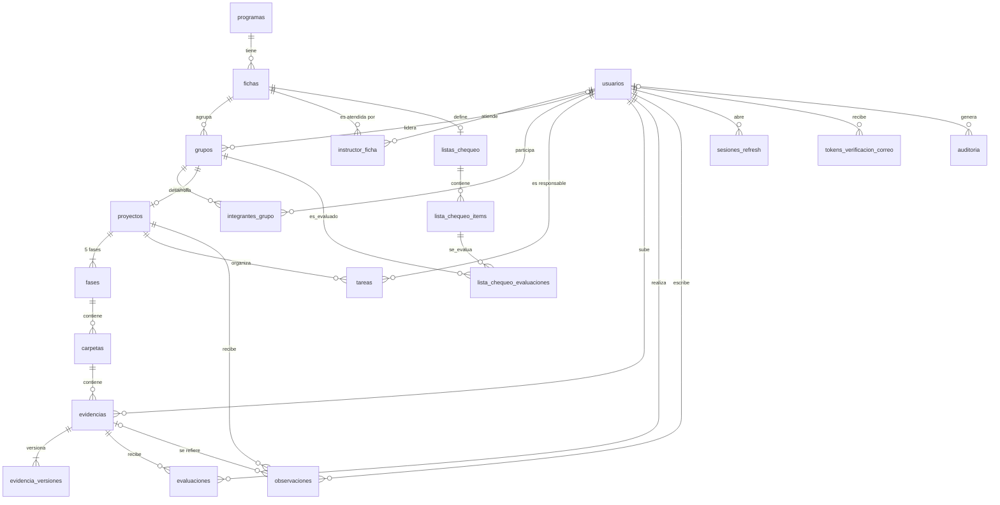

# Esquema de base de datos — ZENDA v12

<!--
  ¿Qué? Descripción del modelo relacional de ZENDA: tablas, columnas, restricciones e índices.
  ¿Para qué? Ser la referencia única del esquema para backend, pruebas y documentación.
  ¿Impacto? Todas las consultas SQL del backend dependen de estos nombres; no hay ORM que absorba un cambio.
-->

---

## Identificación

| Campo | Valor |
| --- | --- |
| **Motor** | PostgreSQL 14 o superior |
| **Tablas** | 20 (3 sin cambios, 10 modificadas, 7 nuevas) |
| **Base** | `Database/zenda_bd.sql` (v11) + `Database/migraciones/001_v12.sql` |
| **Convención** | Tablas y columnas en español, `snake_case`; claves primarias `<tabla>_id` generadas por identidad |
| **Fecha** | Octubre 2026 |

> **Orden de aplicación:** `zenda_bd.sql` crea la base v11 y `001_v12.sql` la lleva a v12 sin borrar datos. La migración elimina `rol_scrum` y `sub_rol_intencion`, por lo que **el código del backend debe actualizarse en el mismo despliegue** ([RF-001](../requisitos/RFs/RF-001_registro_de_aprendiz.md), [RF-014](../requisitos/RFs/RF-014_creacion_de_proyecto.md), [RF-015](../requisitos/RFs/RF-015_unirse_a_un_proyecto.md)).

---

## 1. Diagrama entidad-relación

---

## 2. Diccionario de datos

Leyenda de la columna **Cambio**: 🆕 nueva · ✏️ modificada · — sin cambios.

### 2.1 `programas`

Catálogo de programas de formación. **Estado:** Existente.

| Columna | Tipo | Restricciones | Descripción | Cambio |
| --- | --- | --- | --- | --- |
| `programa_id` | INT | PK, identidad | Identificador | — |
| `codigo_programa` | INT | UNIQUE, NOT NULL | Código SENA del programa (ADSO = 2338) | — |
| `nombre_programa` | VARCHAR(220) | NOT NULL | Nombre del programa | — |

### 2.2 `usuarios`

Todas las personas con acceso al sistema. **Estado:** Modificada.

| Columna | Tipo | Restricciones | Descripción | Cambio |
| --- | --- | --- | --- | --- |
| `usuario_id` | INT | PK, identidad | Identificador | — |
| `rol` | tipo_rol | NOT NULL | `APRENDIZ`, `INSTRUCTOR`, `COORDINADOR` o `ADMINISTRADOR` | — |
| `nombre`, `apellido` | VARCHAR(100) | NOT NULL | Datos personales | — |
| `correo` | VARCHAR(150) | UNIQUE, NOT NULL | Correo de acceso (`@soy.sena.edu.co` para aprendices) | — |
| `contrasena` | VARCHAR(255) | NOT NULL | Hash bcrypt | — |
| `tipo_documento` | VARCHAR(10) | CHECK, por defecto `CC` | `CC`, `TI`, `CE`, `PA` o `PPT` | ✏️ |
| `numero_documento` | VARCHAR(30) | — | Número de documento | — |
| `estado` | VARCHAR(20) | NOT NULL, por defecto `Activo` | Solo `Activo` inicia sesión | — |
| `acepto_legales_en` | TIMESTAMP | — | Fecha de aceptación de los textos legales | 🆕 |
| `correo_verificado_en` | TIMESTAMP | — | Fecha de verificación del correo | 🆕 |
| `fecha_creacion`, `fecha_actualizacion` | TIMESTAMP | NOT NULL | Auditoría básica | — |

**Columna eliminada:** `sub_rol_intencion`.

### 2.3 `fichas`

Grupos de formación de un programa. **Estado:** Existente.

| Columna | Tipo | Restricciones | Descripción | Cambio |
| --- | --- | --- | --- | --- |
| `ficha_id` | INT | PK, identidad | Identificador | — |
| `programa_id` | INT | FK → programas | Programa | — |
| `numero_ficha` | INT | UNIQUE, NOT NULL | Número oficial de la ficha | — |
| `fecha_inicio`, `fecha_fin` | DATE | NOT NULL | Vigencia de la ficha | — |
| `jornada` | VARCHAR(20) | — | Diurna, Tarde, etc. | — |

### 2.4 `instructor_ficha`

Vinculación de un instructor con una ficha, con historial. **Estado:** Modificada.

| Columna | Tipo | Restricciones | Descripción | Cambio |
| --- | --- | --- | --- | --- |
| `instructor_ficha_id` | INT | PK, identidad | Identificador | — |
| `instructor_id` | INT | FK → usuarios | Instructor | — |
| `ficha_id` | INT | FK → fichas | Ficha | — |
| `fecha_inicio` | TIMESTAMP | NOT NULL | Inicio de la vinculación | 🆕 |
| `fecha_fin` | TIMESTAMP | NULL = vigente | Cierre de la vinculación | 🆕 |

### 2.5 `grupos`

Grupo `General` de cada ficha y grupos de proyecto. **Estado:** Modificada.

| Columna | Tipo | Restricciones | Descripción | Cambio |
| --- | --- | --- | --- | --- |
| `grupo_id` | INT | PK, identidad | Identificador | — |
| `ficha_id` | INT | FK → fichas | Ficha | — |
| `lider_id` | INT | FK → usuarios, NULL si es General | Líder del grupo de proyecto | ✏️ |
| `nombre_grupo` | VARCHAR(50) | NOT NULL | Nombre | — |
| `codigo_grupo` | VARCHAR(30) | UNIQUE, NOT NULL | `GEN-<ficha>` o `PRY-XXXXXX` | — |
| `estado_grupo` | VARCHAR(20) | por defecto `Activo` | Estado | — |
| `tipo_grupo` | VARCHAR(10) | CHECK | `GENERAL` o `PROYECTO` (reemplaza la comparación por nombre) | 🆕 |
| `cupo_integrantes` | INT | CHECK > 0 | Cupo máximo; NULL en General | 🆕 |
| `fecha_creacion` | TIMESTAMP | NOT NULL | Creación | — |

### 2.6 `integrantes_grupo`

Pertenencia de un usuario a un grupo. **Estado:** Modificada.

| Columna | Tipo | Restricciones | Descripción | Cambio |
| --- | --- | --- | --- | --- |
| `integrante_id` | INT | PK, identidad | Identificador | — |
| `grupo_id`, `usuario_id` | INT | FK, UNIQUE conjunto | Grupo y usuario | — |
| `estado_integrante` | VARCHAR(20) | por defecto `Activo` | Estado | — |
| `fecha_ingreso`, `fecha_salida` | TIMESTAMP | salida NULL | Permanencia | — |

**Columna eliminada:** `rol_scrum`.

### 2.7 `proyectos`

Proyecto formativo de un grupo (relación 1 a 1). **Estado:** Modificada.

| Columna | Tipo | Restricciones | Descripción | Cambio |
| --- | --- | --- | --- | --- |
| `proyecto_id` | INT | PK, identidad | Identificador | — |
| `grupo_id` | INT | FK UNIQUE → grupos | Grupo dueño | — |
| `nombre_proyecto` | VARCHAR(150) | NOT NULL | Nombre | — |
| `descripcion`, `problema`, `objetivo`, `alcance` | VARCHAR(500) | NOT NULL | README del proyecto | — |
| `tecnologias` | VARCHAR(500) | — | Tecnologías | — |
| `fecha_inicio`, `fecha_fin_estimada` | DATE | NOT NULL | Plazos | — |
| `estado_proyecto` | VARCHAR(30) | por defecto `Activo` | `Activo`, `Pausado`, `Finalizado` | — |
| `fecha_actualizacion` | TIMESTAMP | NOT NULL | Última modificación | 🆕 |

### 2.8 `fases`

Las 5 fases fijas del proyecto. **Estado:** Modificada.

| Columna | Tipo | Restricciones | Descripción | Cambio |
| --- | --- | --- | --- | --- |
| `fase_id` | INT | PK, identidad | Identificador | — |
| `proyecto_id` | INT | FK → proyectos | Proyecto | — |
| `numero_fase` | INT | UNIQUE con proyecto | 1 a 5 | — |
| `nombre_fase` | VARCHAR(100) | NOT NULL | Nombre de la fase | — |
| `estado_fase` | VARCHAR(30) | CHECK | `Pendiente`, `En revisión`, `Aprobada` o `Desaprobada` | ✏️ |

### 2.9 `carpetas`

Carpeta creada por los aprendices dentro de una fase. **Estado:** Modificada.

| Columna | Tipo | Restricciones | Descripción | Cambio |
| --- | --- | --- | --- | --- |
| `carpeta_id` | INT | PK, identidad | Identificador | — |
| `fase_id` | INT | FK → fases | Fase | — |
| `nombre_carpeta` | VARCHAR(150) | NOT NULL | Nombre libre | — |
| `fecha_creacion` | TIMESTAMP | NOT NULL | Creación | — |
| `estado_carpeta` | VARCHAR(20) | CHECK | `Pendiente`, `En revisión`, `Aprobada` o `Desaprobada` | 🆕 |
| `creada_por` | INT | FK → usuarios | Autor | 🆕 |
| `fecha_actualizacion` | TIMESTAMP | NOT NULL | Última modificación | 🆕 |

### 2.10 `evidencias`

Identidad de una evidencia; el contenido está en sus versiones. **Estado:** Modificada.

| Columna | Tipo | Restricciones | Descripción | Cambio |
| --- | --- | --- | --- | --- |
| `evidencia_id` | INT | PK, identidad | Identificador | — |
| `carpeta_id` | INT | FK → carpetas | Carpeta | — |
| `usuario_id` | INT | FK → usuarios | Quién la subió | — |
| `nombre_evidencia` | VARCHAR(200) | NOT NULL | Nombre | — |
| `tipo_evidencia` | VARCHAR(20) | CHECK | `ARCHIVO` o `ENLACE` (espejo de la versión vigente) | ✏️ |
| `ubicacion` | TEXT | NOT NULL | URL o ruta (espejo de la versión vigente) | — |
| `fecha_subida` | TIMESTAMP | NOT NULL | Primera subida | — |
| `eliminada` | BOOLEAN | NOT NULL, `false` | Borrado lógico | 🆕 |
| `eliminada_por` | INT | FK → usuarios | Quién la eliminó | 🆕 |
| `fecha_eliminacion` | TIMESTAMP | — | Cuándo | 🆕 |
| `fecha_actualizacion` | TIMESTAMP | NOT NULL | Última modificación | 🆕 |

### 2.11 `evidencia_versiones`

Historial de contenidos de una evidencia. **Estado:** Nueva.

| Columna | Tipo | Restricciones | Descripción | Cambio |
| --- | --- | --- | --- | --- |
| `version_id` | INT | PK, identidad | Identificador | 🆕 |
| `evidencia_id` | INT | FK → evidencias | Evidencia | 🆕 |
| `numero_version` | INT | UNIQUE con evidencia | 1, 2, 3… | 🆕 |
| `tipo_evidencia` | VARCHAR(20) | CHECK | `ARCHIVO` o `ENLACE` | 🆕 |
| `ubicacion` | TEXT | NOT NULL | Enlace o ruta en el almacenamiento | 🆕 |
| `nombre_original` | VARCHAR(255) | — | Nombre del archivo subido | 🆕 |
| `tipo_mime` | VARCHAR(100) | — | Tipo real detectado | 🆕 |
| `tamano_bytes` | BIGINT | ≥ 0 | Tamaño | 🆕 |
| `hash_sha256` | CHAR(64) | — | Huella para detectar duplicados | 🆕 |
| `subida_por` | INT | FK → usuarios | Autor de la versión | 🆕 |
| `fecha_subida` | TIMESTAMP | NOT NULL | Cuándo | 🆕 |
| `vigente` | BOOLEAN | única por evidencia | Versión actual | 🆕 |

### 2.12 `evaluaciones`

Evaluaciones de evidencias, con historial. **Estado:** Modificada.

| Columna | Tipo | Restricciones | Descripción | Cambio |
| --- | --- | --- | --- | --- |
| `evaluacion_id` | INT | PK, identidad | Identificador | — |
| `evidencia_id` | INT | FK → evidencias | Evidencia | — |
| `instructor_id` | INT | FK → usuarios | Quién evaluó | — |
| `resultado` | VARCHAR(20) | CHECK | `APROBADO` o `REPROBADO` | ✏️ |
| `fecha_evaluacion` | TIMESTAMP | NOT NULL | Cuándo | — |
| `vigente` | BOOLEAN | única por evidencia | La última es la válida; no se sobrescribe | 🆕 |

### 2.13 `observaciones`

Observaciones del instructor sobre un proyecto o evidencia. **Estado:** Existente.

| Columna | Tipo | Restricciones | Descripción | Cambio |
| --- | --- | --- | --- | --- |
| `observacion_id` | INT | PK, identidad | Identificador | — |
| `evidencia_id` | INT | FK → evidencias, NULL | Evidencia relacionada | — |
| `proyecto_id` | INT | FK → proyectos | Proyecto | — |
| `instructor_id` | INT | FK → usuarios | Autor | — |
| `titulo` | VARCHAR(150) | NOT NULL | Título | — |
| `descripcion` | VARCHAR(500) | NOT NULL | Texto | — |
| `fecha_observacion` | TIMESTAMP | NOT NULL | Cuándo | — |

### 2.14 `tareas`

Tablero de tareas del proyecto. **Estado:** Modificada.

| Columna | Tipo | Restricciones | Descripción | Cambio |
| --- | --- | --- | --- | --- |
| `tarea_id` | INT | PK, identidad | Identificador | — |
| `proyecto_id` | INT | FK → proyectos | Proyecto | — |
| `responsable_id` | INT | FK → usuarios | Responsable | — |
| `titulo` | VARCHAR(150) | NOT NULL | Título | — |
| `descripcion` | VARCHAR(500) | — | Detalle | — |
| `prioridad` | VARCHAR(20) | CHECK | `Alta`, `Media` o `Baja` | — |
| `estado` | VARCHAR(20) | CHECK | `Pendiente`, `En proceso`, `Finalizada`, `Confirmada` o `Incompleta` | — |
| `fecha_inicio`, `fecha_limite`, `fecha_finalizacion` | DATE | — | Plazos | — |
| `fecha_creacion`, `fecha_actualizacion` | TIMESTAMP | NOT NULL | Auditoría | 🆕 |

### 2.15 `listas_chequeo`

Lista de chequeo de una ficha (una por ficha). **Estado:** Nueva.

| Columna | Tipo | Restricciones | Descripción | Cambio |
| --- | --- | --- | --- | --- |
| `lista_id` | INT | PK, identidad | Identificador | 🆕 |
| `ficha_id` | INT | FK UNIQUE → fichas | Ficha dueña (no el instructor) | 🆕 |
| `nombre` | VARCHAR(150) | NOT NULL | Nombre | 🆕 |
| `creada_por` | INT | FK → usuarios | Instructor que la creó | 🆕 |
| `archivo_origen` | TEXT | — | Referencia al Excel importado | 🆕 |
| `fecha_creacion`, `fecha_actualizacion` | TIMESTAMP | NOT NULL | Auditoría | 🆕 |

### 2.16 `lista_chequeo_items`

Evidencias esperadas, por fase. **Estado:** Nueva.

| Columna | Tipo | Restricciones | Descripción | Cambio |
| --- | --- | --- | --- | --- |
| `item_id` | INT | PK, identidad | Identificador | 🆕 |
| `lista_id` | INT | FK → listas_chequeo | Lista | 🆕 |
| `numero_fase` | INT | CHECK 1–5 | Fase | 🆕 |
| `nombre_evidencia` | VARCHAR(200) | NOT NULL | Evidencia esperada | 🆕 |
| `descripcion` | VARCHAR(500) | — | Detalle | 🆕 |
| `obligatorio` | BOOLEAN | NOT NULL, `true` | Cuenta para el avance | 🆕 |
| `orden` | INT | NOT NULL | Posición | 🆕 |

### 2.17 `lista_chequeo_evaluaciones`

Resultado de un ítem para un grupo, con historial. **Estado:** Nueva.

| Columna | Tipo | Restricciones | Descripción | Cambio |
| --- | --- | --- | --- | --- |
| `evaluacion_id` | INT | PK, identidad | Identificador | 🆕 |
| `item_id` | INT | FK → lista_chequeo_items | Ítem | 🆕 |
| `grupo_id` | INT | FK → grupos | Grupo evaluado | 🆕 |
| `resultado` | VARCHAR(20) | CHECK | `Aprobado`, `No aprobado` o `Pendiente` | 🆕 |
| `comentario` | VARCHAR(500) | — | Observación | 🆕 |
| `evaluador_id` | INT | FK → usuarios | Quién evaluó | 🆕 |
| `fecha_evaluacion` | TIMESTAMP | NOT NULL | Cuándo | 🆕 |
| `vigente` | BOOLEAN | única por ítem y grupo | La última es la válida | 🆕 |

### 2.18 `sesiones_refresh`

Tokens de refresco para renovar la sesión. **Estado:** Nueva.

| Columna | Tipo | Restricciones | Descripción | Cambio |
| --- | --- | --- | --- | --- |
| `sesion_id` | INT | PK, identidad | Identificador | 🆕 |
| `usuario_id` | INT | FK → usuarios | Dueño | 🆕 |
| `token_hash` | CHAR(64) | UNIQUE | SHA-256; nunca se guarda el token | 🆕 |
| `fecha_creacion`, `fecha_expiracion` | TIMESTAMP | NOT NULL | Vigencia (7 días) | 🆕 |
| `revocada` | BOOLEAN | NOT NULL | Cierre de sesión o rotación | 🆕 |

### 2.19 `tokens_verificacion_correo`

Tokens de un solo uso para verificar el correo. **Estado:** Nueva.

| Columna | Tipo | Restricciones | Descripción | Cambio |
| --- | --- | --- | --- | --- |
| `token_id` | INT | PK, identidad | Identificador | 🆕 |
| `usuario_id` | INT | FK → usuarios | Dueño | 🆕 |
| `token_hash` | CHAR(64) | UNIQUE | SHA-256 | 🆕 |
| `fecha_expiracion` | TIMESTAMP | NOT NULL | Vigencia | 🆕 |
| `usado_en` | TIMESTAMP | — | Cuándo se usó | 🆕 |

### 2.20 `auditoria`

Registro de acciones críticas. **Estado:** Nueva.

| Columna | Tipo | Restricciones | Descripción | Cambio |
| --- | --- | --- | --- | --- |
| `auditoria_id` | INT | PK, identidad | Identificador | 🆕 |
| `usuario_id` | INT | FK → usuarios, NULL | Quién actuó | 🆕 |
| `accion` | VARCHAR(60) | NOT NULL | p. ej. `CAMBIAR_ROL` | 🆕 |
| `entidad` | VARCHAR(40) | NOT NULL | Tabla afectada | 🆕 |
| `entidad_id` | INT | — | Registro afectado | 🆕 |
| `detalle` | JSONB | — | Datos del cambio | 🆕 |
| `fecha` | TIMESTAMP | NOT NULL | Cuándo | 🆕 |

---

## 3. Valores permitidos

| Campo | Valores |
| --- | --- |
| `usuarios.rol` | `APRENDIZ`, `INSTRUCTOR`, `COORDINADOR`, `ADMINISTRADOR` |
| `usuarios.tipo_documento` | `CC`, `TI`, `CE`, `PA`, `PPT` |
| `grupos.tipo_grupo` | `GENERAL`, `PROYECTO` |
| `fases.estado_fase`, `carpetas.estado_carpeta` | `Pendiente`, `En revisión`, `Aprobada`, `Desaprobada` |
| `evidencias.tipo_evidencia` | `ARCHIVO`, `ENLACE` |
| `evaluaciones.resultado` | `APROBADO`, `REPROBADO` |
| `tareas.estado` | `Pendiente`, `En proceso`, `Finalizada`, `Confirmada`, `Incompleta` |
| `tareas.prioridad` | `Alta`, `Media`, `Baja` |
| `lista_chequeo_evaluaciones.resultado` | `Aprobado`, `No aprobado`, `Pendiente` |

---

## 4. Restricciones de integridad clave

| Restricción | Tabla | Qué garantiza | Regla |
| --- | --- | --- | --- |
| `uq_instructor_ficha_vigente` | `instructor_ficha` | Un instructor tiene una sola vinculación vigente por ficha, pero puede tener varias históricas. | [RN-024](../requisitos/reglas-de-negocio.md#rn-024--asignación-instructorficha-con-historial) |
| `uq_evaluaciones_vigente` | `evaluaciones` | Una sola evaluación vigente por evidencia; las anteriores quedan como historial. | [RN-017](../requisitos/reglas-de-negocio.md#rn-017--historial-de-evaluaciones) |
| `uq_evidencia_version_vigente` | `evidencia_versiones` | Una sola versión vigente por evidencia. | [RN-014](../requisitos/reglas-de-negocio.md#rn-014--versionado-y-borrado-lógico) |
| `uq_lc_evaluacion_vigente` | `lista_chequeo_evaluaciones` | Una sola evaluación vigente por ítem y grupo. | [RN-027](../requisitos/reglas-de-negocio.md#rn-027--avance-de-la-lista-de-chequeo) |
| `chk_grupos_lider` | `grupos` | Todo grupo de proyecto tiene líder; solo el grupo `General` puede no tenerlo. | [RN-008](../requisitos/reglas-de-negocio.md#rn-008--líder-del-grupo) |
| `chk_grupos_cupo` | `grupos` | El cupo, si existe, es positivo. | [RN-009](../requisitos/reglas-de-negocio.md#rn-009--cupo-del-grupo) |
| `proyectos.grupo_id` UNIQUE | `proyectos` | Un grupo tiene a lo sumo un proyecto. | — |
| `listas_chequeo.ficha_id` UNIQUE | `listas_chequeo` | Una lista por ficha. | [RN-026](../requisitos/reglas-de-negocio.md#rn-026--lista-de-chequeo-por-ficha) |

> **Pendiente:** la regla "un aprendiz, un solo proyecto activo" ([RN-007](../requisitos/reglas-de-negocio.md#rn-007--un-proyecto-activo-por-aprendiz)) abarca dos tablas y hoy solo la valida el backend. Se puede reforzar con un disparador (*trigger*) o con una columna redundante en `integrantes_grupo`; está registrado en [RNF-014.4](../requisitos/RNFs/RNF-014_concurrencia_y_consistencia.md).

---

## 5. Índices

Además de las claves primarias y las restricciones únicas, la migración crea índices sobre las claves foráneas de consulta frecuente: `grupos(ficha_id)`, `integrantes_grupo(usuario_id)`, `instructor_ficha(ficha_id)`, `carpetas(fase_id)`, `evidencias(carpeta_id)`, `evidencias(usuario_id)`, `evaluaciones(instructor_id)`, `observaciones(proyecto_id)`, `tareas(proyecto_id)`, `tareas(responsable_id)`, `lista_chequeo_items(lista_id)` y `auditoria(fecha)`.

---

## 6. Notas de migración

| Tema | Qué hace la migración | Qué debe revisar el equipo |
| --- | --- | --- |
| Sub-roles | Elimina `usuarios.sub_rol_intencion` e `integrantes_grupo.rol_scrum`. | Quitar su uso en `register`, `crearProyecto`, `unirseAProyecto`, el seed y `Register.jsx`. |
| Grupo `General` | Lo marca `GENERAL` y deja `lider_id` en `NULL`. | Reemplazar `nombre_grupo <> 'General'` por `tipo_grupo = 'PROYECTO'` en las consultas. |
| Cupo | Asigna a cada grupo existente el número actual de integrantes. | Definir el rango permitido ([RN-009](../requisitos/reglas-de-negocio.md#rn-009--cupo-del-grupo)). |
| Evidencias | Convierte tipos antiguos a `ENLACE` y crea la versión 1 de cada una. | Escribir en `evidencia_versiones` al subir o reemplazar. |
| Evaluaciones | Marca como no vigentes las duplicadas y deja una vigente por evidencia. | Insertar en lugar de `UPDATE` en `evaluarEvidencia`. |
| Fases | Convierte el estado `En proceso` en `En revisión`. | Los nombres de fase de los datos de prueba difieren de los que crea `crearProyecto`; unificarlos en el seed. |
| Instructores | Conserva las vinculaciones y agrega fechas. | Cerrar con `fecha_fin` en lugar de `DELETE` al reasignar. |
| Usuarios existentes | Marca el correo como verificado. | Pedir la aceptación de los textos legales en el siguiente inicio de sesión (`acepto_legales_en` queda `NULL`). |

La migración no se ha ejecutado contra una base real en este entorno: pruébala primero sobre una copia (`pg_dump` antes de aplicar).
